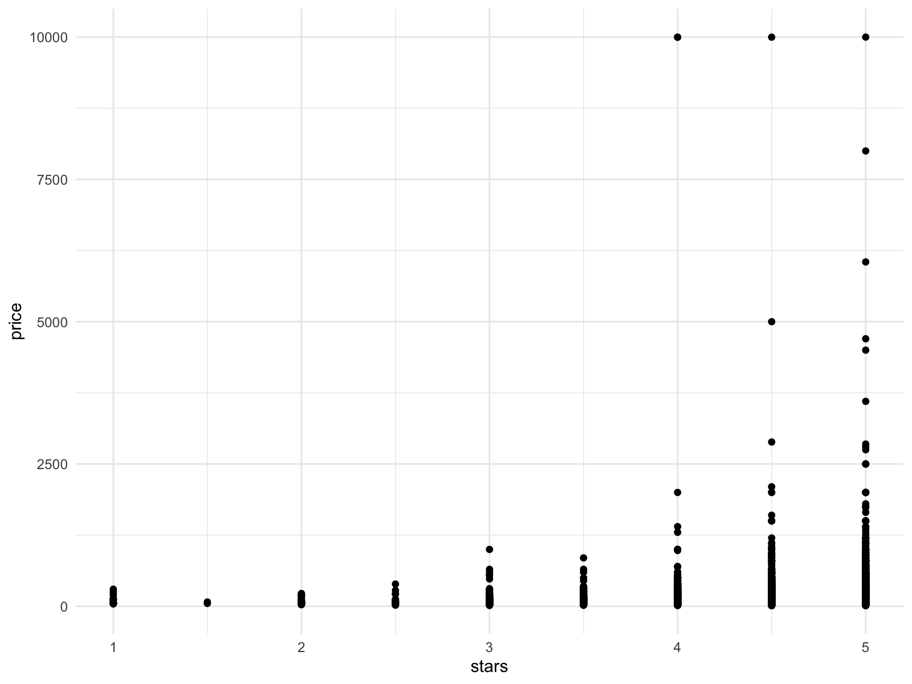

Bootstrapping
================

## Simulate data

``` r
n_samp = 250

sim_df_const = 
  tibble(
    x = rnorm(n_samp, 1, 1),
    error = rnorm(n_samp, 0, 1),
    y = 2 + 3 * x + error
  )

sim_df_nonconst = sim_df_const %>% 
  mutate(
  error = error * .75 * x,
  y = 2 + 3 * x + error
)
```

Plot the datasets.

``` r
sim_df_const %>% 
  ggplot(aes(x = x, y = y)) +
  geom_point() +
  geom_smooth(method = "lm")
```


``` r
sim_df_nonconst %>% 
  ggplot(aes(x = x, y = y)) +
  geom_point() +
  geom_smooth(method = "lm")
```


Fit the data with linear models.

``` r
lm(y ~ x, data = sim_df_const) %>% broom::tidy()
```

    ## # A tibble: 2 × 5
    ##   term        estimate std.error statistic   p.value
    ##   <chr>          <dbl>     <dbl>     <dbl>     <dbl>
    ## 1 (Intercept)     1.98    0.0981      20.2 3.65e- 54
    ## 2 x               3.04    0.0699      43.5 3.84e-118

``` r
lm(y ~ x, data = sim_df_nonconst) %>% broom::tidy()
```

    ## # A tibble: 2 × 5
    ##   term        estimate std.error statistic   p.value
    ##   <chr>          <dbl>     <dbl>     <dbl>     <dbl>
    ## 1 (Intercept)     1.93    0.105       18.5 1.88e- 48
    ## 2 x               3.11    0.0747      41.7 5.76e-114

## Draw one bootstrap sample

``` r
boot_sample = function(df) {
  
  sample_frac(df, replace = TRUE) %>% 
    arrange(x)
  
}
```

Check if this works …

``` r
boot_sample(sim_df_nonconst) %>% 
  ggplot(aes(x = x, y = y)) +
  geom_point(alpha = .3) +
  geom_smooth(method = "lm") + 
  ylim(-5, 16)
```


``` r
boot_sample(sim_df_nonconst) %>% 
  lm(y ~ x, data = .) %>% 
  broom::tidy()
```

    ## # A tibble: 2 × 5
    ##   term        estimate std.error statistic   p.value
    ##   <chr>          <dbl>     <dbl>     <dbl>     <dbl>
    ## 1 (Intercept)     1.90    0.0982      19.3 2.45e- 51
    ## 2 x               3.14    0.0688      45.6 1.18e-122

## Many samples and analysis

``` r
boot_straps = 
  tibble(
    strap_number = 1:1000,
    strap_sample = rerun(1000, boot_sample(sim_df_nonconst))
  )

boot_straps %>% 
  pull(strap_sample) %>% 
  .[[1]]
```

    ## # A tibble: 250 × 3
    ##         x  error       y
    ##     <dbl>  <dbl>   <dbl>
    ##  1 -1.29   1.40  -0.454 
    ##  2 -0.989 -1.97  -2.93  
    ##  3 -0.914 -0.908 -1.65  
    ##  4 -0.914 -0.908 -1.65  
    ##  5 -0.805  0.292 -0.123 
    ##  6 -0.805  0.292 -0.123 
    ##  7 -0.665 -0.544 -0.539 
    ##  8 -0.641 -0.416 -0.338 
    ##  9 -0.606 -0.106  0.0774
    ## 10 -0.606 -0.106  0.0774
    ## # … with 240 more rows

Can I run my analysis on these …?

``` r
boot_results =
  boot_straps %>% 
  mutate(
    models = map(.x = strap_sample, ~ lm(y ~ x, data = .x)),
    results = map(models, broom::tidy)
  ) %>% 
  select(strap_number, results) %>% 
  unnest(results)
```

What do I have now?

``` r
boot_results %>% 
  group_by(term) %>% 
  summarise(
    mean_est = mean(estimate),
    sd_est = sd(estimate)
  )
```

    ## # A tibble: 2 × 3
    ##   term        mean_est sd_est
    ##   <chr>          <dbl>  <dbl>
    ## 1 (Intercept)     1.93 0.0748
    ## 2 x               3.11 0.101

Look at the distributions.

``` r
boot_results %>% 
  filter(term == "x") %>% 
  ggplot(aes(x = estimate)) +
  geom_density()
```


Construct a bootstrap CI.

``` r
boot_results %>% 
  group_by(term) %>% 
  summarise(
    ci_lower = quantile(estimate, 0.025),
    ci_upper = quantile(estimate, 0.975)
  )
```

    ## # A tibble: 2 × 3
    ##   term        ci_lower ci_upper
    ##   <chr>          <dbl>    <dbl>
    ## 1 (Intercept)     1.79     2.08
    ## 2 x               2.91     3.31

## Bootstrap using modelr

Can we simplify anything …?

``` r
sim_df_nonconst %>% 
  bootstrap(1000, id = "strap_number") %>% 
  mutate(
    models = map(.x = strap, ~ lm(y ~ x, data = .x)),
    results = map(models, broom::tidy)
  ) %>% 
  select(strap_number, results) %>% 
  unnest(results) %>% 
  group_by(term) %>% 
  summarise(
    mean_est = mean(estimate),
    sd_est = sd(estimate)
  )
```

    ## # A tibble: 2 × 3
    ##   term        mean_est sd_est
    ##   <chr>          <dbl>  <dbl>
    ## 1 (Intercept)     1.93 0.0762
    ## 2 x               3.11 0.104

## Revisit nyc airbnb

``` r
data("nyc_airbnb")

nyc_airbnb =
  nyc_airbnb %>% 
  mutate(stars = review_scores_location / 2) %>% 
  rename(
    borough = neighbourhood_group
  ) %>% 
  filter(borough != "Staten Island") %>% 
  select(price, stars, borough, neighbourhood, room_type)
```

``` r
nyc_airbnb %>% 
  ggplot(aes(x = stars, y = price)) +
  geom_point()
```



``` r
airbnb_boot_results = 
  nyc_airbnb %>% 
  filter(borough == "Manhattan") %>% 
  drop_na(stars) %>% 
  bootstrap(1000, id = "strap_number") %>% 
  mutate(
    models = map(.x = strap, ~ lm(price ~ stars, data = .x)),
    results = map(models, broom::tidy)
  ) %>% 
  select(strap_number, results) %>% 
  unnest(results)

airbnb_boot_results %>% 
  group_by(term) %>% 
  summarise(
    mean_est = mean(estimate),
    sd_est = sd(estimate)
  )
```

    ## # A tibble: 2 × 3
    ##   term        mean_est sd_est
    ##   <chr>          <dbl>  <dbl>
    ## 1 (Intercept)    -35.0  31.3 
    ## 2 stars           43.4   6.34

Compare this to `lm`.

``` r
nyc_airbnb %>% 
  filter(borough == "Manhattan") %>% 
  drop_na(stars) %>% 
  lm(price ~ stars, data = .) %>% 
  broom::tidy()
```

    ## # A tibble: 2 × 5
    ##   term        estimate std.error statistic  p.value
    ##   <chr>          <dbl>     <dbl>     <dbl>    <dbl>
    ## 1 (Intercept)    -34.3     22.9      -1.50 1.35e- 1
    ## 2 stars           43.3      4.78      9.07 1.39e-19

``` r
airbnb_boot_results %>% 
  filter(term == "stars") %>% 
  ggplot(aes(x = estimate)) +
  geom_density()
```


