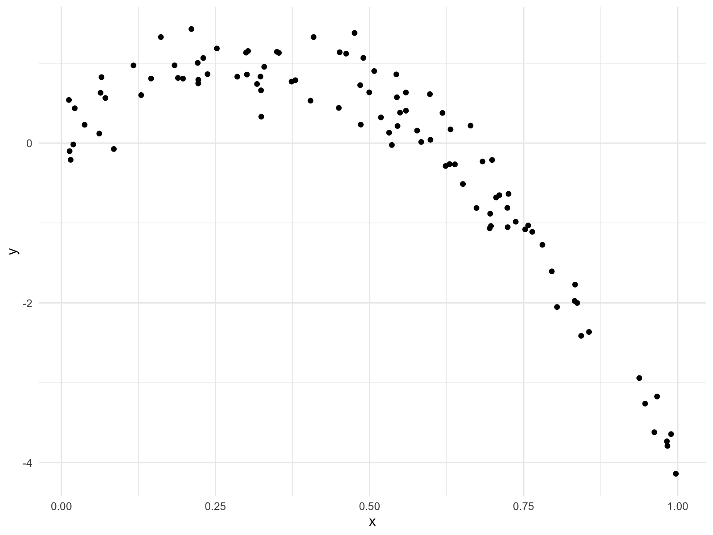
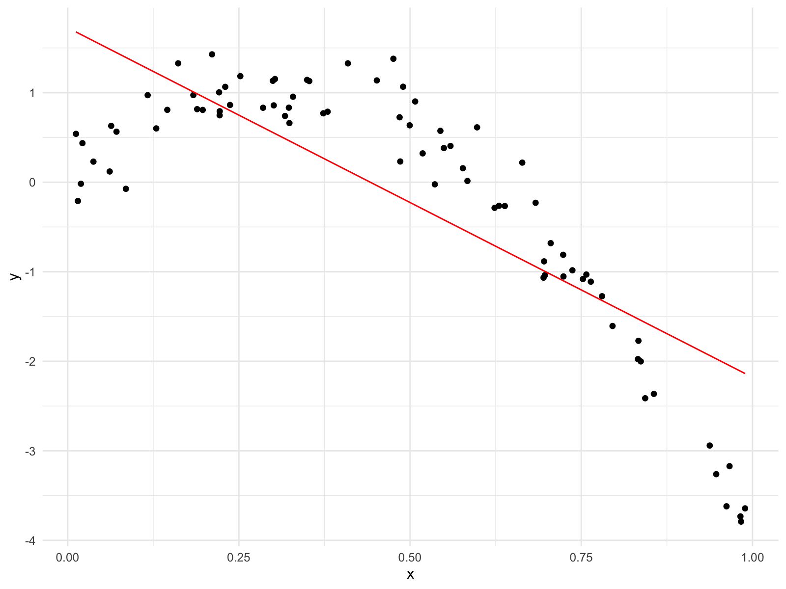
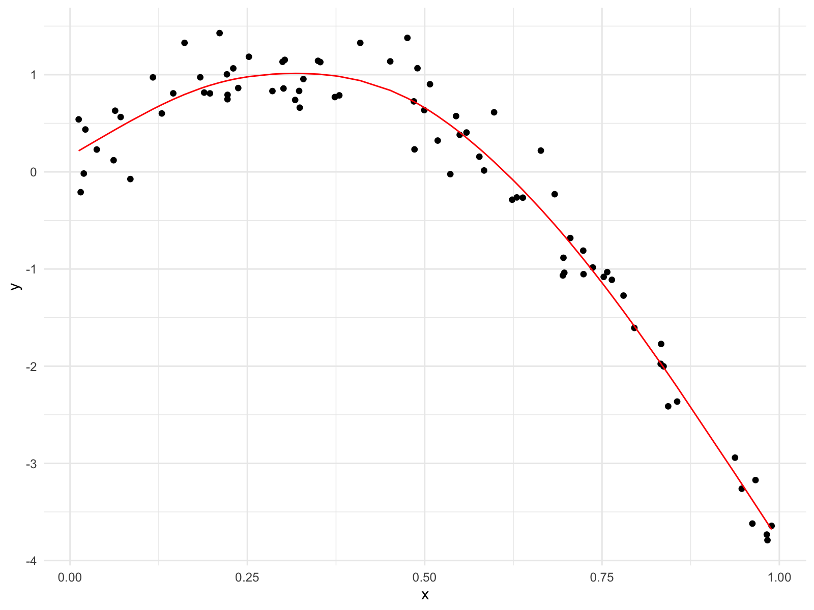
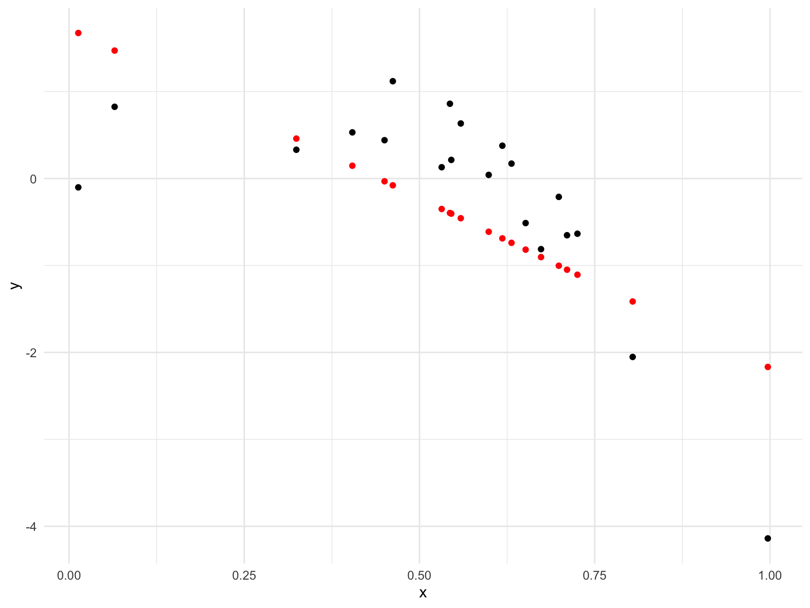

Cross Validation
================

## Step 1

``` r
nonlin_df = 
  tibble(
    id = 1:100,
    x = runif(100, 0, 1),
    y = 1 - 10 * (x - 0.3) ^ 2 + rnorm(100, 0, 0.3)
  )

nonlin_df %>% 
  ggplot(aes(x = x, y = y)) + 
  geom_point()
```



## CV by hand

Let’s get this by hand - construct a training (80%) and testing (20%)
dataset.

``` r
train_df = sample_n(nonlin_df, 80)
test_df = anti_join(nonlin_df, train_df, by = "id")

train_df %>% 
  ggplot(aes(x = x, y = y)) + 
  geom_point() + 
  geom_point(data = test_df, color = "red")
```


Let’s try to fit three models.

``` r
linear_mod = lm(y ~ x, data = train_df)
smooth_mod = mgcv::gam(y ~ s(x), data = train_df)
wiggly_mod = mgcv::gam(y ~ s(x, k = 30), sp = 10e-6, data = train_df)
```

Let’s see the results.

``` r
train_df %>%
  add_predictions(linear_mod) %>% 
  ggplot(aes(x = x, y = y)) +
  geom_point() +
  geom_line(aes(y = pred), color = "red")
```



``` r
train_df %>%
  add_predictions(smooth_mod) %>% 
  ggplot(aes(x = x, y = y)) +
  geom_point() +
  geom_line(aes(y = pred), color = "red")
```



``` r
train_df %>%
  add_predictions(wiggly_mod) %>% 
  ggplot(aes(x = x, y = y)) +
  geom_point() +
  geom_line(aes(y = pred), color = "red")
```


Let’s make predictions and compute RMSEs.

``` r
# Lower prediction errors mean better prediction (lower is better)
rmse(linear_mod, test_df)
```

    ## [1] 0.9102863

``` r
rmse(smooth_mod, test_df)
```

    ## [1] 0.3623424

``` r
rmse(wiggly_mod, test_df)
```

    ## [1] 0.485361

``` r
test_df %>% 
  add_predictions(linear_mod) %>% 
  ggplot(aes(x = x, y = y)) +
  geom_point() +
  geom_point(aes(y = pred), color = "red")
```



## CV using `modelr`

``` r
cv_df = 
  crossv_mc(nonlin_df, 100) 

cv_df %>% 
  pull(train) %>% 
  .[[1]] %>% 
  as_tibble()
```

    ## # A tibble: 79 × 3
    ##       id      x       y
    ##    <int>  <dbl>   <dbl>
    ##  1     1 0.997  -4.14  
    ##  2     2 0.804  -2.05  
    ##  3     4 0.962  -3.62  
    ##  4     5 0.724  -1.05  
    ##  5     7 0.710  -0.652 
    ##  6     8 0.696  -0.884 
    ##  7    10 0.559   0.405 
    ##  8    11 0.673  -0.812 
    ##  9    12 0.796  -1.61  
    ## 10    15 0.0851 -0.0739
    ## # … with 69 more rows

``` r
cv_df = cv_df %>% 
  mutate(
    train = map(train, as_tibble),
    test = map(test, as_tibble)
  ) %>% 
  mutate(
    linear_fits = map(.x = train, ~ lm(y ~ x, data = .x)),
    smooth_fits = map(.x = train, ~ mgcv::gam(y ~ s(x), data = .x)),
    wiggly_fits = map(.x = train, ~ mgcv::gam(y ~ s(x, k = 30), sp = 10e-6, data = .x))
  ) %>% 
  mutate(
    rmse_linear = map2_dbl(.x = linear_fits, .y = test, ~ rmse(model = .x, data = .y)),
    rmse_smooth = map2_dbl(.x = smooth_fits, .y = test, ~ rmse(model = .x, data = .y)),
    rmse_wiggly = map2_dbl(.x = wiggly_fits, .y = test, ~ rmse(model = .x, data = .y))
  )
```

Make a box plot …

``` r
cv_df %>% 
  select(starts_with("rmse")) %>% 
  pivot_longer(
    everything(),
    names_to = "model",
    names_prefix = "rmse_",
    values_to = "rmse"
  ) %>% 
  ggplot(aes(x = model, y = rmse)) +
  geom_boxplot()
```


## Try it on a real dataset

``` r
growth_df = read_csv("data/nepalese_children.csv")
```

    ## Rows: 2705 Columns: 5
    ## ── Column specification ────────────────────────────────────────────────────────
    ## Delimiter: ","
    ## dbl (5): age, sex, weight, height, armc
    ## 
    ## ℹ Use `spec()` to retrieve the full column specification for this data.
    ## ℹ Specify the column types or set `show_col_types = FALSE` to quiet this message.

``` r
growth_df %>% 
  ggplot(aes(x = weight, y = armc)) +
  geom_point(alpha = .3)
```


Brief aside on piecewise linear model

``` r
growth_df =
  growth_df %>% 
  mutate(
    weight_pwl = (weight > 7) * (weight - 7)
  )
```

Compare 3 fitted models - linear model, smooth model, piecewise linear
model

``` r
linear_model = lm(armc ~ weight, data = growth_df)
pwl_model = lm(armc ~ weight + weight_pwl, data = growth_df)
smooth_model = mgcv::gam(armc ~ s(weight), data = growth_df)
```

**Linear model.**

``` r
growth_df %>% 
  add_predictions(linear_model) %>% 
  ggplot(aes(x = weight, y = armc)) +
  geom_point(alpha = .3) +
  geom_line(aes(y = pred), color = "red")
```


**Piecewise linear model.**

``` r
growth_df %>% 
  add_predictions(pwl_model) %>% 
  ggplot(aes(x = weight, y = armc)) +
  geom_point(alpha = .3) +
  geom_line(aes(y = pred), color = "red")
```


**Smooth model.**

``` r
growth_df %>% 
  add_predictions(smooth_model) %>% 
  ggplot(aes(x = weight, y = armc)) +
  geom_point(alpha = .3) +
  geom_line(aes(y = pred), color = "red")
```


``` r
cv_df = 
  crossv_mc(growth_df, 100) %>% 
  mutate(
    train = map(train, as_tibble),
    test = map(test, as_tibble)
  ) 

cv_df = 
  cv_df %>% 
  mutate(
    linear_fits = map(.x = train, ~ lm(armc ~ weight, data = .x)),
    pwl_fits    = map(.x = train, ~ lm(armc ~ weight + weight_pwl, data = .x)),
    smooth_fits = map(.x = train, ~ mgcv::gam(armc ~ s(weight), data = .x))
  ) %>% 
  mutate(
    rmse_linear = map2_dbl(.x = linear_fits, .y = test, ~ rmse(model = .x, data = .y)),
    rmse_pwl    = map2_dbl(.x = pwl_fits,    .y = test, ~ rmse(model = .x, data = .y)),
    rmse_smooth = map2_dbl(.x = smooth_fits, .y = test, ~ rmse(model = .x, data = .y))
  )
```

Let’s look at the results.

``` r
cv_df %>% 
  select(starts_with("rmse")) %>% 
  pivot_longer(
    everything(),
    names_to = "model",
    names_prefix = "rmse_",
    values_to = "rmse"
  ) %>% 
  mutate(
    model = fct_inorder(model)
  ) %>% 
  ggplot(aes(x = model, y = rmse)) +
  geom_boxplot()
```


