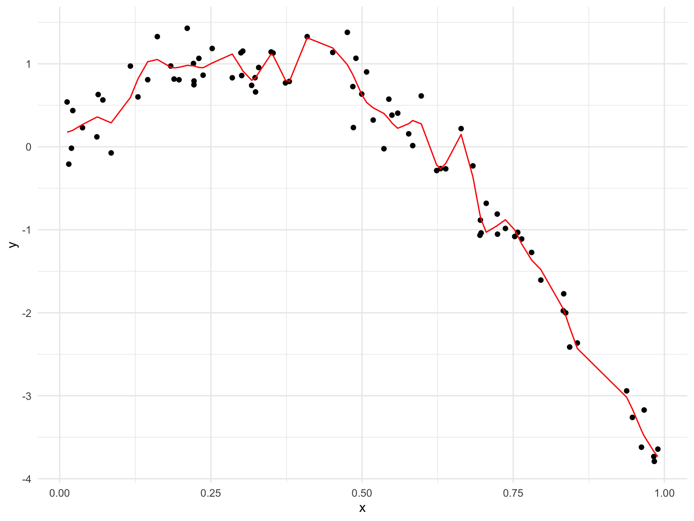

Cross Validation
================

## Step 1

``` r
nonlin_df = 
  tibble(
    id = 1:100,
    x = runif(100, 0, 1),
    y = 1 - 10 * (x - 0.3) ^ 2 + rnorm(100, 0, 0.3)
  )

nonlin_df %>% 
  ggplot(aes(x = x, y = y)) + 
  geom_point()
```


## CV by hand

Let’s get this by hand - construct a training (80%) and testing (20%)
dataset.

``` r
train_df = sample_n(nonlin_df, 80)
test_df = anti_join(nonlin_df, train_df, by = "id")

train_df %>% 
  ggplot(aes(x = x, y = y)) + 
  geom_point() + 
  geom_point(data = test_df, color = "red")
```


Let’s try to fit three models.

``` r
linear_mod = lm(y ~ x, data = train_df)
smooth_mod = mgcv::gam(y ~ s(x), data = train_df)
wiggly_mod = mgcv::gam(y ~ s(x, k = 30), sp = 10e-6, data = train_df)
```

Let’s see the results.

``` r
train_df %>%
  add_predictions(linear_mod) %>% 
  ggplot(aes(x = x, y = y)) +
  geom_point() +
  geom_line(aes(y = pred), color = "red")
```


``` r
train_df %>%
  add_predictions(smooth_mod) %>% 
  ggplot(aes(x = x, y = y)) +
  geom_point() +
  geom_line(aes(y = pred), color = "red")
```


``` r
train_df %>%
  add_predictions(wiggly_mod) %>% 
  ggplot(aes(x = x, y = y)) +
  geom_point() +
  geom_line(aes(y = pred), color = "red")
```



Let’s make predictions and compute RMSEs.

``` r
# Lower prediction errors mean better prediction (lower is better)
rmse(linear_mod, test_df)
```

    ## [1] 0.9113684

``` r
rmse(smooth_mod, test_df)
```

    ## [1] 0.2872366

``` r
rmse(wiggly_mod, test_df)
```

    ## [1] 0.2517431

``` r
test_df %>% 
  add_predictions(linear_mod) %>% 
  ggplot(aes(x = x, y = y)) +
  geom_point() +
  geom_point(aes(y = pred), color = "red")
```


## CV using `modelr`

``` r
cv_df = 
  crossv_mc(nonlin_df, 100) 

cv_df %>% 
  pull(train) %>% 
  .[[1]] %>% 
  as_tibble()
```

    ## # A tibble: 79 × 3
    ##       id     x      y
    ##    <int> <dbl>  <dbl>
    ##  1     1 0.106  0.563
    ##  2     2 0.965 -3.67 
    ##  3     3 0.749 -1.50 
    ##  4     5 0.783 -1.23 
    ##  5     6 0.758 -1.04 
    ##  6     7 0.859 -2.53 
    ##  7     8 0.276  0.952
    ##  8     9 0.944 -3.08 
    ##  9    10 0.461  0.762
    ## 10    11 0.466  1.02 
    ## # … with 69 more rows

``` r
cv_df = cv_df %>% 
  mutate(
    train = map(train, as_tibble),
    test = map(test, as_tibble)
  )
```

Fit models in each training model and then apply to the corresponding
testing model.

``` r
cv_df =
  cv_df %>% 
  mutate(
    linear_fits = map(.x = train, ~ lm(y ~ x, data = .x)),
    smooth_fits = map(.x = train, ~ mgcv::gam(y ~ s(x), data = .x)),
    wiggly_fits = map(.x = train, ~ mgcv::gam(y ~ s(x, k = 30), sp = 10e-6, data = .x))
  ) %>% 
  mutate(
    rmse_linear = map2_dbl(.x = linear_fits, .y = test, ~ rmse(model = .x, data = .y)),
    rmse_smooth = map2_dbl(.x = smooth_fits, .y = test, ~ rmse(model = .x, data = .y)),
    rmse_wiggly = map2_dbl(.x = wiggly_fits, .y = test, ~ rmse(model = .x, data = .y))
  )
```

Visualize the results.

``` r
cv_df %>% 
  select(starts_with("rmse")) %>% 
  pivot_longer(
    everything(),
    names_to = "model", 
    values_to = "rmse",
    names_prefix = "rmse_") %>% 
  mutate(model = fct_inorder(model)) %>% 
  ggplot(aes(x = model, y = rmse)) + geom_violin()
```


